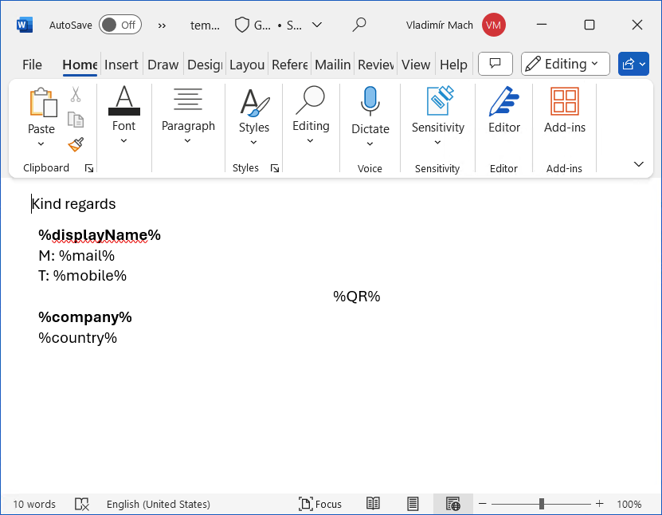
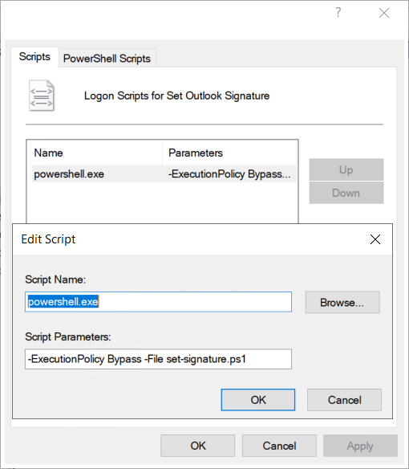
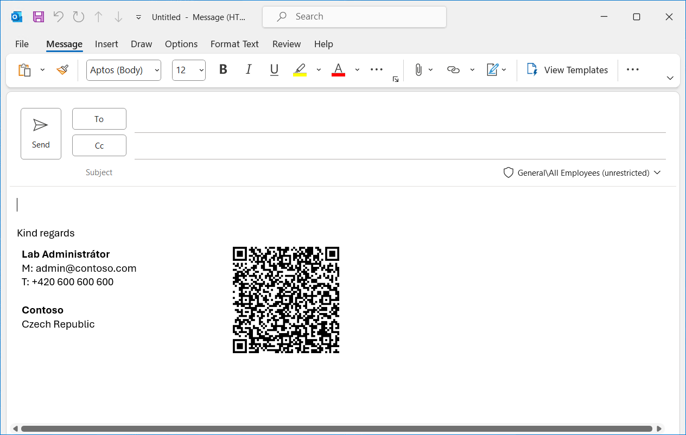

# Outlook signature generator

Simple command line utility that generates Outlook signature from specified Word template using attributes from Active Directory of currently logged-on user.

## Usage 

```
Mail.OutlookSignature.exe "signature-template.docx"
```

### How it works

This console application accepts one positional parameter with path to a Word document that acts as template. Document can contains [variables](#supported-variables) that would be replaced with actual values of currently logged-on user sourced from Active Directory.

After variables are replaced with actual values, this parsed document is set as Outlook signature and set as default user signature. By default it also locks this signature as mandatory and blocks any user changes to the signature. This lock can be blocked with `LockSignature` settings. You can also configure Active Directory group that would act as allow list with users who can change signature by themself (configuration setting `LockSignatureOverrideGroupName`).

If Outlook was running while running the application was executed, Outlook needs to be restarted to see the updated signature.

For troubleshooting, you can see generated signature in `%appdata%\Microsoft\Signatures` folder.

#### Word template document



#### Group policy Logon script
`Set-Signature.ps1`
```powershell
Start-Process -FilePath "$($PSScriptRoot)\App\Mail.OutlookSignature.exe" `
    -WorkingDirectory $PSScriptRoot -ArgumentList (Join-Path $PSScriptRoot "template.docx") `
    -NoNewWindow `
    -Wait
``` 



#### Generated signature in Outlook



## Supported variables

You can use these variables in template Word document:

| Variable                        | Source LDAP field            | Description         | ADUC Tab     |
| ------------------------------- | ---------------------------- | ------------------- | ------------ |
| `%givenName%`                   | `givenName`                  | First name          | General      |
| `%sn%`                          | `sn`                         | Last name           | General      |
| `%displayName%`                 | `displayName`                | Display name        | General      |
| `%department%`                  | `department`                 | Department          | Organization |
| `%company%`                     | `company`                    | Company             | Organization |
| `%telephoneNumber%`             | `telephoneNumber`            | Telephone number    | General      |
| `%mobile%`                      | `mobile`                     | Mobile              | Telephones   |
| `%mail%`                        | `mail`                       | E-Mail              | General      |
| `%physicalDeliveryOfficeName%`  | `physicalDeliveryOfficeName` | Office              | General      |
| `%postalCode%`                  | `postalCode`                 | Zip/Postal Code     | Address      |
| `%streetAddress%`               | `streetAddress`              | Street              | Address      |
| `%title%`                       | `title`                      | Job Title           | Organization |
| `%l%`                           | `l`                          | City                | Address      |
| `%st%`                          | `st`                         | State/province      | Address      |
| `%sc%`                          | `c`                          | Country             | Address      |
| `%country%`                     |                              | Expanded country name using internal dictionary | -- |
| `%QR%`                          |                              | QR Code with VCARD content | -- |

### App configuration parameters

You can configure application with these options in `Mail.OutlookSignature.exe.config` file located in the same folder as executable.

| Settings                         | Default Value        | Description         |
| -------------------------------- | -------------------- | ------------------- |
| `SignatureName`                  | Corporate signature  | Name of the signature in Outlook application |
| `LockSignature`                  | `true`               | If set to `true`, user can't change/create new signature in Outlook |
| `LockSignatureOverrideGroupName` | ``                   | Name of the Active Directory group with users that can change/create signatures in Outlook when lock is set |


## Dependencies

- https://github.com/OfficeDev/Open-Xml-PowerTools for Word document parsing
- https://www.nuget.org/packages/MessagingToolkit.QRCode for QR code image generation
